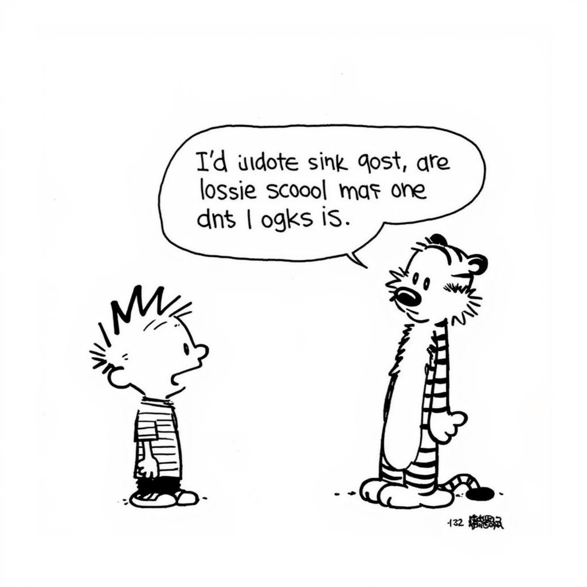
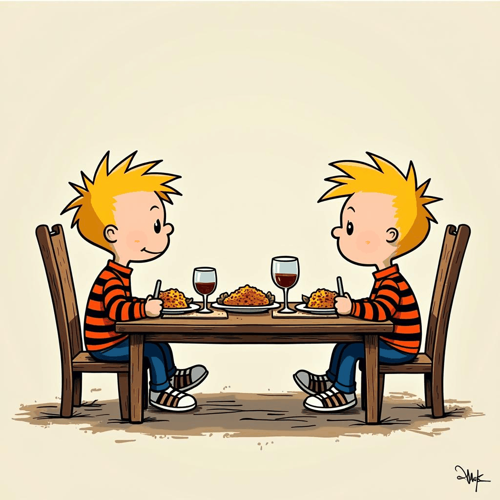
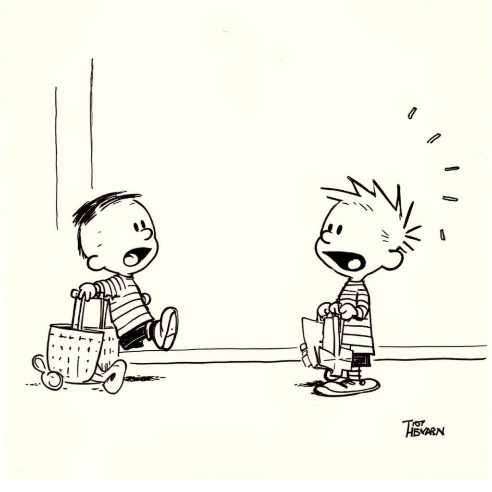

# Calvin and Hobbes Comic Strip Generation - LoRA Fine-Tuning on Flux Model
---
This project fine-tunes the **Flux.1-dev** model using **LoRA (Low-Rank Adaptation)** to generate Calvin and Hobbes comic strip images. The entire process includes scraping data, annotating the dataset using a vision model, and fine-tuning the model for image generation. The fine-tuned model is available [here](https://huggingface.co/zhreyu/ComicStrips-Lora-Fluxdev), and the dataset used for training will be published soon.
You can check try this model at [HuggingFace Spaces](https://huggingface.co/spaces/zhreyu/zhreyu-ComicStrips-Lora-Fluxdev)
**Total Downloads**: [](https://huggingface.co/zhreyu/ComicStrips-Lora-Fluxdev)

## Project Overview

### **Model**
The base model used for fine-tuning is [Flux.1-dev](https://huggingface.co/black-forest-labs/FLUX.1-dev). This model is designed to generate comic strip images, and I fine-tuned it using LoRA to create unique Calvin and Hobbes comic strip scenes.

---

## Data Preparation

### 1. **Data Collection (Scraping Reddit Images)**

I began by collecting comic strip images from Reddit posts using a custom Python scraper. The script fetches and downloads images from a specified Reddit user’s posts, handling pagination and filtering based on file types like `.jpg`, `.png`, `.jpeg`, and `.gif`. This process allowed me to build a comprehensive dataset for fine-tuning the model.

### 2. **Merging Datasets (Optional)**

Once the images were downloaded, I used `merge_datasets.py` to combine datasets from multiple sources if needed. This script also removed duplicate images to ensure the dataset was clean and ready for annotation.

### 3. **Annotating Images Using LLava Model**

After preparing the dataset, I annotated the images using the **LLava:13b** vision model through **Ollama**. The `annotate_dataset.py` script generated textual descriptions of each image, focusing on the interaction between characters in the comic strips. This annotation helped the model understand the content of the images for training.

### Annotation Example:
- Input Image: Calvin and Hobbes fishing.
- Annotated Description: *Calvin and Hobbes attempt to catch a fish while boating together.*

The annotated dataset was saved in a CSV file (`image_descriptions.csv`) for further processing.

---

## Dataset Preparation for Fine-tuning

### 4. **Text Preparation**

I ran `txt_prep.py` to convert the annotated dataset into the required format. This script generated individual text files for each image, providing detailed descriptions needed for fine-tuning the **Flux.1-dev** model.

---

## Fine-tuning the Flux Model with LoRA

### 5. **Environment Setup**

To fine-tune the model, the **AI Toolkit** repository (with submodules) is already included in this repository, so there's no need to clone it again.

To set up the environment:

```bash
cd ComicStrips-LoRA/
python -m venv venv
source venv/bin/activate
pip install torch
pip install -r requirements.txt
pip install --upgrade accelerate transformers diffusers huggingface_hub
```

### 6. **Upload Your Dataset**

Create a new folder in the root of the repository called `dataset`. Move the `.jpg`, `.jpeg`, `.png` images and their corresponding `.txt` files generated in the previous steps into this folder.

### 7. **Login to Hugging Face**

Login to Hugging Face and request access to the **Flux.1-dev** model:

1. Get a **READ** token from [Hugging Face](https://huggingface.co/).
2. Request access to [Flux.1-dev](https://huggingface.co/black-forest-labs/FLUX.1-dev).
3. Run the following command and paste the access token:

```bash
huggingface-cli login
```

### 8. **Start Training**

I edited a configuration file for fine-tuning:

1. Copy an example config file from `config/examples/` to the `config/` folder and rename it (e.g., `calvin_and_hobbes_finetune.yml`).
2. Edit the config file:
    - Set `folder_path: "/path/to/your/dataset/folder"` to the actual dataset folder path.
3. Start the fine-tuning process:

```bash
python run.py config/calvin_and_hobbes_finetune.yml
```

The training will begin, and the model will fine-tune on the custom dataset.

---

## Model and Dataset

### **Model on Hugging Face**

The trained model is available on [Hugging Face](https://huggingface.co/your-username/ComicStrips_LoRA_FluxModel). You can download and use the fine-tuned model directly from there.

### **Dataset**

The dataset used for this project will be made available soon.

---

## Samples generated during Fine-tuning. 

Here are some sample GIFs that show how the model was converging:

1. Calvin and Hobbes swimming in the pool:

    

2. Calvin and Hobbes climbing the tree:

   

3. Calvin and Hobbes talking about quitting school:

   

4. Calvin and Hobbes eating dinner:

   

5. Calvin and Hobbes go shopping:

   

---

## Acknowledgements

Special thanks to the creators of the **AI Toolkit** for providing the tools necessary to fine-tune the Flux.1-dev model using LoRA. 
